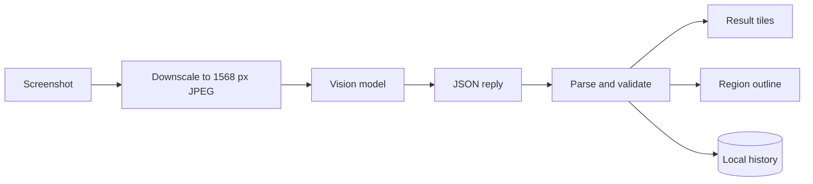

# errorlens

Paste a screenshot of an error and get a plain explanation, likely causes and the fix.

- Paste, drop or upload a screenshot of an error
- Plain explanation, ranked causes, fix steps with copyable code and search queries
- The error region is outlined on the screenshot
- Local history of the last six results
- Demo mode without a key

## Try it

[](https://vercel.com/new/clone?repository-url=https%3A%2F%2Fgithub.com%2Fedgeorgie%2Ferrorlens)

```bash
npm install
npm run dev
```

Open http://localhost:3000. Requires Node 22 or newer.

1. Press Ctrl+V with a screenshot, or try the sample.
2. Add optional context and press Analyze.
3. Reopen earlier results from Recent on this device.

## Configuration

No environment variables. API keys are entered in the app and stay in the browser.

## How it works



An image is prepared in the browser and sent with the report prompt. The reply is parsed into a report, rendered as tiles, saved to history and its region is drawn on the screenshot. Full diagrams and the module map are in [docs/architecture.md](docs/architecture.md).

## Key concepts

| Term | Meaning |
|---|---|
| Vision model | A model that accepts images as input. |
| Report | The validated structure: error, stack, explanation, causes, fixes, searches, region. |
| Region | A rectangle as fractions of the image that marks where the error is. |
| Likelihood | The model's 0 to 1 estimate for each cause, clamped and sorted. |
| Demo mode | A generated screenshot and a prepared report, with no key or network. |

## Design system

Typography: Display and text, Plus Jakarta Sans, weight 800 for headlines; Code, DM Mono.

| Token | Value | Use |
|---|---|---|
| `bg` | `#fbfaf8` | Page background |
| `ink` | `#0d0d12` | Text and the error tile |
| `pink` | `#ff2e88` | Primary accent and the region outline |
| `pink-soft` | `#ffdcec` | Soft accent |
| `lemon` | `#fff2a8` | Causes tile |
| `mint` | `#c8f7dc` | Fix tile |

- Bento tiles map one question to one tile: what, why, how, where to look.
- The error tile is the darkest element on the page.

Motion, components and rationale: [docs/design-system.md](docs/design-system.md).

## Data flow and privacy

| Data | Where it goes | Stored |
|---|---|---|
| Screenshot | Sent to the chosen model provider from the browser | Not stored remotely |
| Thumbnails and reports | Last six kept locally | localStorage |
| Provider key | localStorage, sent only to the provider | This browser |

## Limits

- Region coordinates from a model can be imprecise.
- Provider CORS behavior can change.
- Large images are downscaled to 1568 px.

## Deployment

The app is fully client-side, so it can be hosted as static files.

- **GitHub Pages:** `npm run deploy:pages` builds a static export and publishes it to the `gh-pages` branch. Enable Pages from that branch; on a free plan the repository must be public.
- **Vercel or any Node host:** use the Deploy button above. No configuration is needed.

## Documentation

| Document | What it answers |
|---|---|
| [docs/index.md](docs/index.md) | Map of all documentation |
| [docs/architecture.md](docs/architecture.md) | Diagrams and modules |
| [docs/spec/spec.md](docs/spec/spec.md) | Requirements and acceptance criteria |
| [docs/spec/traceability.md](docs/spec/traceability.md) | Requirement to code, test and evidence |
| [docs/design-system.md](docs/design-system.md) | Tokens, motion, components |
| [docs/glossary.md](docs/glossary.md) | Definitions |
| [docs/evaluation.md](docs/evaluation.md) | Self-assessment against a review rubric |
| [docs/adr](docs/adr) | Decision records |

## For AI agents and tools

- [AGENTS.md](AGENTS.md) defines the workflow and quality gates for agents and people.
- [llms.txt](public/llms.txt) is served at `/llms.txt` when deployed and points to the key documents.
- [docs/spec/requirements.json](docs/spec/requirements.json) is the machine-readable requirement list with status, files and tests.
- `npm run verify` is the single deterministic gate: typecheck, lint, traceability check, tests and build.

LLM integration: Screenshots can contain adversarial text, which is untrusted input to the model. The model has no tools, the reply is schema-validated, links are built only as encoded search URLs, and all text is rendered as text.

## Scripts

| Script | Purpose |
|---|---|
| `npm run dev` | Development server |
| `npm run build` | Production build |
| `npm run typecheck` | TypeScript check |
| `npm run lint` | ESLint |
| `npm test` | Unit tests |
| `npm run spec:check` | Traceability gate |
| `npm run verify` | All of the above |

## Contributing

See [CONTRIBUTING.md](CONTRIBUTING.md). Security reports: [SECURITY.md](SECURITY.md).

## License

MIT.
