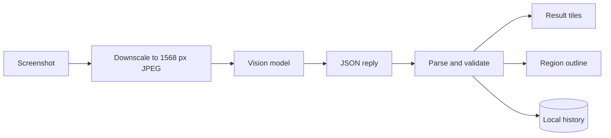
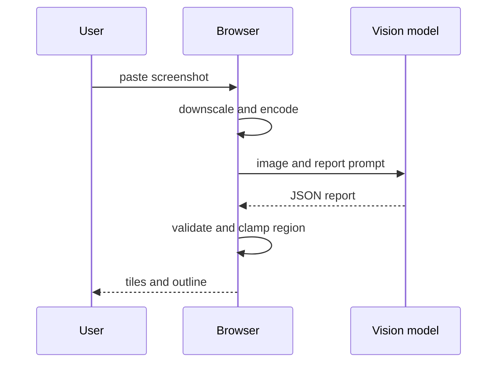

# Architecture

## Data flow

## Main sequence

## Modules

| Path | Responsibility |
|---|---|
| `lib/image.ts` | Downscaling and encoding |
| `lib/vision.ts` | Provider requests |
| `lib/report.ts` | Prompt, parsing and region validation |
| `lib/history.ts` | Local history |
| `lib/demo.ts` | Sample screenshot and report |
| `components/Tiles.tsx` | Result tiles |

## Principles

- Pure logic lives in `lib/` and is tested without a browser; components stay thin.
- Network, storage and model replies are validated at the boundary.
- Secrets and user content stay in the browser.

## Decisions

- [No server in the path](adr/0001-no-server-in-the-path.md)
